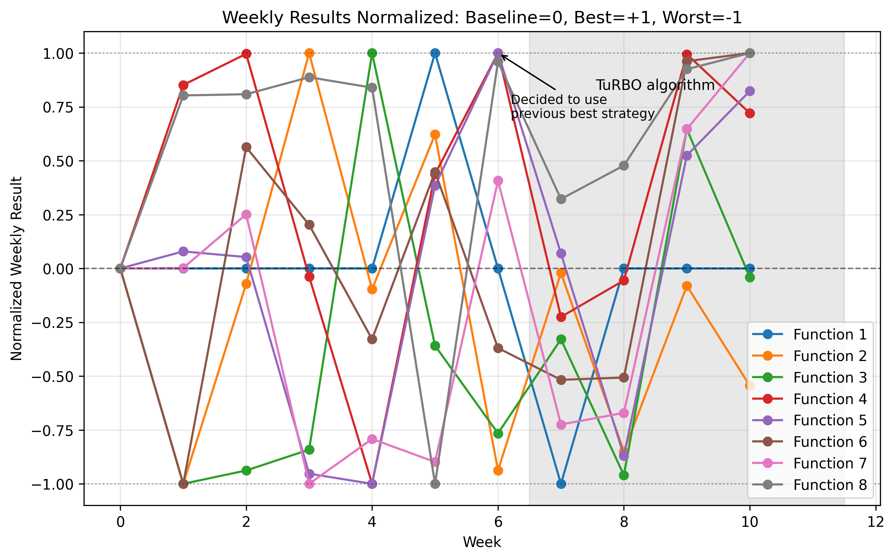

# Imperial ML Capstone
This is part of the capstone project for the Professional Certificate in Machine Learning and AI from Imperial College Business School.

The project has been set up in a way that real-world conditions are simulated. Results can only be submitted once a week, and the results are back in a few days. This means that any brute-force strategy is out of the question and we are given enough time to reflect on an approach for the following week. There is a total of 13 attempts in 13 weeks.

## Black‑Box Optimization Goal
The goal of this project is the optimization of **8 black-box functions**. For each function, a certain number of initial data points are provided (different number for each function), and each week I must submit a new point. This simulates expensive, slow evaluations.

All variables range from 0 to 1 and vary from 2‑dimensional to 8‑dimensional.

In a **black-box optimization** problem, you have a function:

```
f(x): R^d → R
```

that you can **evaluate** (possibly at high cost), but:

- You don’t know its analytic form  
- You can’t compute gradients  
- Each evaluation is expensive or noisy  

Goal:

```
x* = argmin_x f(x)
```

We treat `f(x)` as a **true black box**.

## Tools and Libraries Used
- **NumPy**: vectorised numerical operations  
- **Scikit‑learn**: Gaussian Processes, SVMs, kernels, scaling  
- **SciPy**: optimization routines, distances, statistics  
- **TensorFlow / Keras**: neural-network surrogate experiments  
- **Pandas**: storing evolving results in a `results_df` dataframe  
- **Pytorch** and **BoTorch**: TurBO (Trust Region Bayesian Optimization) algorithm
- **Jupyter Notebooks**: chronological workflow documentation  

## Files and Reproducibility

### Inputs
Initial challenge data is in the `initial_data/` folder.

### Outputs
Weekly platform results (`inputs.txt`, `outputs.txt`) are stored in `submissions/`.

### Reproducing the Work
Re-run the notebook with all data downloaded, ensuring sequential execution since sampling is simulated week by week.

## Results Overview (up to week 12 submissions)

| Function | Baseline Best | Improved Value | % Improvement | Samples Improved |
|----------|---------------|----------------|---------------|------------------|
| 1 | 7.710875114502849e-16 | 2.6752879910742468e-09 | +347,031,616.55% | 1 |
| 2 | 0.6112052157614438 | 0.698220529454849 | +14.24% | 2 |
| 3 | -0.034835313350078584 | -0.001243676514707 | +96.43% | 2 |
| 4 | -4.025542281908162 | 0.650442395576065 | +116.16% | 4 |
| 5 | 1088.8596181962705 | 8662.4825 | +695.40% | 3 |
| 6 | -0.714264947820240 | -0.168848797153551 | +76.36% | 3 |
| 7 | 1.364968304499199 | 2.698828323886699 | 97.72% | 8 |
| 8 | 9.598482002566342 | 9.995335982189101 | 4.13% | 7 |


### Methodology Note
The total number of weeks (total budget) is of 13 weeks (13 queries).

The first 5 weeks consisted of experimentation with Gaussian processes, exploring the functions, adjusting the kernels and familiarizing myself with the field of black-box optimization. This was the occasion to develop intuitions and also to try some small experiments such as using a neural network once to classify input regions as "good" or "bad". 

On week 6, I revisited previous results and adopted an iterative strategy of repeating whichever technique produced the most recent improvement for functions 4-6. 

Then, from week 7 to week 11, using the JetBrains paper on BBO strategies in the NeurIPS 2020 competition, I tried to replicate this technique using a TuRBO algorithm. It defines a Trust Region as a hyper-rectangle around the known best solution with a decaying factor that allows shrinks the trust region when no improvements is found to allow for more fine-grained exploration arount the best point. For the TuRBO implementation with ``botorch``, both RBF and Mattern kernels are used, with either Thompson sampling (implemented as ``MaxPosteriorSampling``) or ``LogExpectedImprovement`` as acquisition functions.

For the last two weeks, I continued the TuRBO for the four functions where it was showing improvements consistently: 3, 6, 7 and 8 and either a simpler implementation or Bayesian optimization or pure random sampling for the rest.  

#### What I would have done differently
During the initial submissions I focused on building Gaussian processes. Even though I have used areas with high sigma values to encourage exploration, I could have been more agressive on exploration at the beginning.

For high-dimensional functions, the results seem to indicate that starting with the TuRBO strategy with bounds applied since the beginning would have yielded better results. Also, if the objective of this project was only to optimize results, I would not have wasted iterations in experimenting with neural networks or SVMs.

I have also encountered issues with randomness and reproducibility. The notebook is conceived to be run in order, as each week's section loads into the arrays the new inputs and outputs. This implies that to continue working on subsequent weeks the whole book must be run, including rerunning previous cells. If because of randomness the results are different every time a cell runs, they are not consistent. I have addressed this by resetting all random seeds at the beginning of the book and copying the submission in a markdown cell for precaution, but not since the beginning of the project.   

### Data datasheet and model card

The [data datasheet](data-datasheet.md) and [model card](model-card.md) are available in their own pages.

## Functions Overview
More details of boundaries, plots and structure are in the notebook.

### Function 1 (2D → 1D)
Contamination-source detection in 2D space; only proximity produces nonzero readings. 

### Function 2 (2D → 1D)
Noisy log-likelihood surface with local optima. 

### Function 3 (3D → 1D)
Drug‑compound triad experiment; objective is minimisation of side effects (maximisation of a transformed output, negative of side-effects).

### Function 4 (4D → 1D)
Hyperparameter optimisation for a costly warehouse‑allocation simulator. Output reflects the difference from the expensive baseline. The objective is to maximize this difference.

### Function 5 (4D → 1D)
Unimodal chemical‑process yield optimisation; single global peak.

### Function 6 (5D → 1D)
Cake‑recipe optimisation with five ingredients; negative scoring system, reframed as maximisation. 0 is the perfect score.

### Function 7 (6D → 1D)
Hyperparameter optimisation of a common ML model.

### Function 8 (8D → 1D)
High‑dimensional ML surrogate optimisation (e.g., 8 hyperparameters). Local maxima may be the practical target.

## Visualisations / end results (Placeholder)
Below a plot over time of all 8 functions and the weekly results, with 0 being the initial baseline, +1 the best results in the series and -1 the worst one:


_To be added: plots, 2D/3D projections, convergence curves, acquisition function, end results._

_To be completed_

## Bibliography

- Eriksson, D., Pearce, M., Gardner, J. R., Turner, R., & Poloczek, M. (2019). *Scalable Global Optimization via Local Bayesian Optimization*. arXiv preprint. [https://arxiv.org/abs/1910.01739](https://arxiv.org/abs/1910.01739) 
- Balandat, M., Karrer, B., Jiang, D. R., Daulton, S., Letham, B., Wilson, A. G., & Bakshy, E. (2019). *BoTorch: A Framework for Efficient Monte-Carlo Bayesian Optimization*. arXiv preprint. [https://arxiv.org/abs/1910.06403](https://arxiv.org/abs/1910.06403) 
- Snoek, J., Rippel, O., Swersky, K., Kiros, R., Satish, N., Sundaram, N., Patwary, M. A., Prabhat, & Adams, R. (2015). *Scalable Bayesian Optimization Using Deep Neural Networks*. arXiv preprint. [https://arxiv.org/abs/1502.05700](https://arxiv.org/abs/1502.05700) 
- Nakayama, H., Arakawa, M., & Washino, K. (2003). *Optimization for Black-box Objective Functions*. In P.M. Pardalos, I. Tsevendorj & R. Enkhbat (Eds.), *Optimization and Optimal Control* (pp. 185–210). World Scientific. DOI: [10.1142/9789812775368_0013](https://doi.org/10.1142/9789812775368_0013) 
## Additional resources & tutorials

- **BoTorch** - Official tutorial for trust-region Bayesian optimization (TuRBO). [https://botorch.org/docs/tutorials/turbo_1/](https://botorch.org/docs/tutorials/turbo_1/) 
- **Official Keras Documentation** - https://keras.io/
- **Intro to Deep Learning with Keras (TensorFlow)**  - https://www.tensorflow.org/tutorials/keras/classification
- **Official NumPy Documentation**  - https://numpy.org/doc/
- **10 Minutes to Pandas**  - https://pandas.pydata.org/docs/user_guide/10min.html
- **YouTube – Pandas Full Course (freeCodeCamp)**  - https://www.youtube.com/watch?v=vmEHCJofslg
- **Scikit-Optimize (skopt)**  - https://scikit-optimize.github.io/


