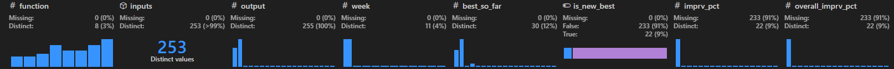

# Project data datasheet 

This project contains a dataset called _inputs\_outputs_ which contains all the inputs and outputs that I have been able to obtain after sampling 8 different functions. This is part of a black-box optimization challenge. 

### Motivation

This dataset allows anybody exploring it to have a clear overview of the different results over time for the different functions. 

### Composition

The dataset consists of all the different sample values (inputs) for all the functions, the week they were queried on and the results. Initial results are indicated with a week number 0. It also contains additional columns that can be derived from the rest such as whether that line is an improvement over known values from previous week, the running best, the overall improvement in % and the % of improvement with respect with the current best. For week 0 those calculations are set to null.

### Collection process

The initial dataset was provided by the Imperial College Business school as part of a BBO challenge and capstone project. Those data points are captured as is from the provided text files. More details can be found in the `graph_report.ipynb` notebook available in this repository. 

Then, after a new query point is identified for each function, all the queries are submitted together via the capstone project portal. Once they are processed, an email is sent back containing all the inputs and outputs known so far. The raw files are available in the `submissions` folder in this repository. These are also ingested and inserted into  _results\_df_.

### Preprocessing and uses

The only preprocessing applied is the parsing of the different source text files. Then, auxiliary columns `best_so_far`, `is_new_best`, `imprv_pct` and `overall_imprv_pct` are computed. Details can be found in the `graph_report.ipynb` notebook available in this repository.

### Distribution and maintenance

I release this freely with no particular license.

During the capstone project, the dataset is actively maintained as weekly results are added. One the capstone project is finished in February 2026, you can contact me via my GitHub profile or open a bug in this repo in case you spot any mistake.